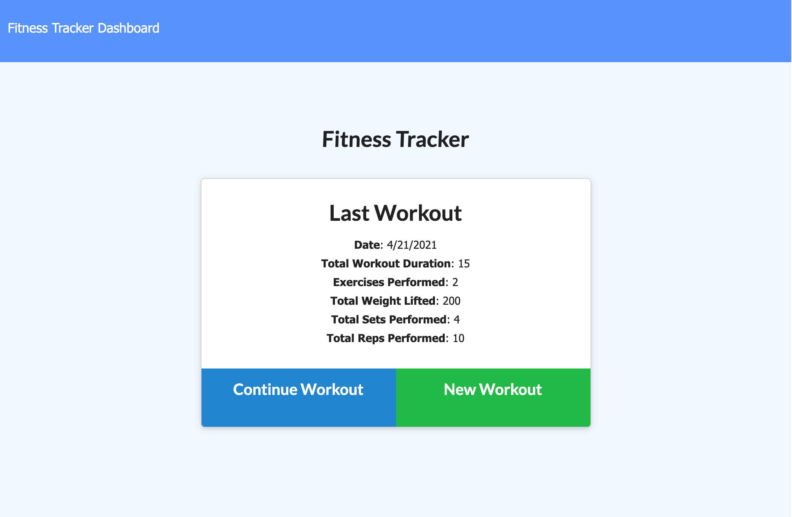
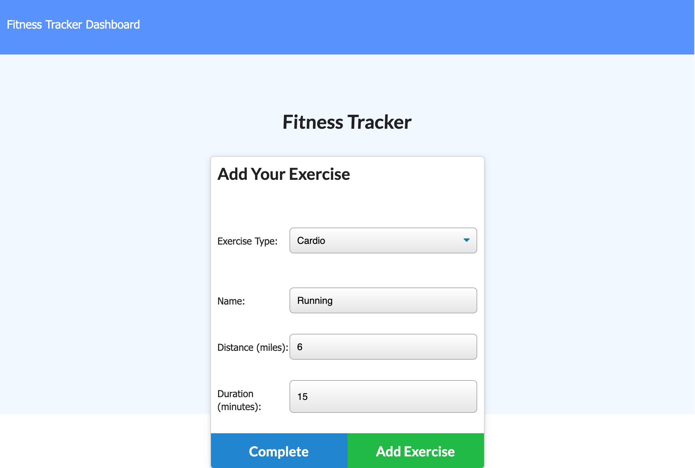
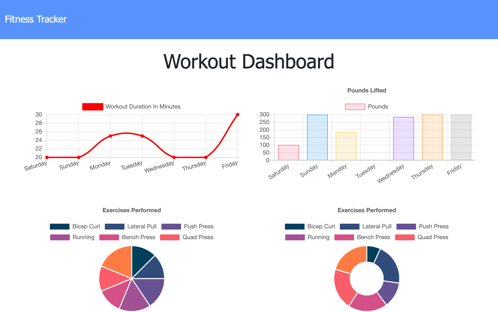

# Workout Tracker

A simple workout tracking app built using Node.js, express.js, MongoDB and Mongoose.

## User Story

As a user, I want to be able to view create and track daily workouts. I want to be able to log multiple exercises in a workout on a given day. I should also be able to track the name, type, weight, sets, reps, and duration of exercise. If the exercise is a cardio exercise, I should be able to track my distance traveled.

## Business Context

A consumer will reach their fitness goals more quickly when they track their workout progress.

## Description

This app allows users to keep track of their workouts by letting them create, add to and store their daily workouts. Users can choose between cardio or resistence training and input specific execise types within these categories. The stats page also offers a chart based summary of their weekly workouts.

## Table of Contents

* [Installation](#installation)
* [Usage](#usage)
* [Contributing Guidelines](#contributing)
* [License](#license)
* [Questions](#questions)

## Installation

This app makes use of the following technologies:
1. Node.js

2. Express.js

3. MongoDB

4. Mongoose

[Click here to view the deployed app]()

Alternatively, the repo can be downloaded and run locally. All the npm packages are provided in the package.json file and running npm i from the command line will install them all. After that just run npm run seed to seed the database and npm start to start app.

## Usage

When a user navigates to the app, they are given the option to create a new workout or continue with their last workout. 

They are then asked to choose between cardio or resistance training before being presented with a form to input information about the type of exercise they chose. If they had chosen to continue a previous workout, the new exercise will be added to that workout. If they had chosen to start a new workout then a new workout will be created in the database. 

When the user navigates to the stats page, they are presented with chart-based representation of their workouts including combined weights of multiple exercises from the past 7 workouts and total duration of each workout from the past 7 days.

## Contributing

 

 Link to Contributor's Covenant:[Contributors Covenant](https://www.contributor-covenant.org/version/2/0/code_of_conduct/) 

 
## License

   
Copyright (c) [2021] [Nida Ghuman]

Permission is hereby granted, free of charge, to any person obtaining a copy
of this software and associated documentation files (the "Software"), to deal
in the Software without restriction, including without limitation the rights
to use, copy, modify, merge, publish, distribute, sublicense, and/or sell
copies of the Software, and to permit persons to whom the Software is
furnished to do so, subject to the following conditions:

The above copyright notice and this permission notice shall be included in all
copies or substantial portions of the Software.

THE SOFTWARE IS PROVIDED "AS IS", WITHOUT WARRANTY OF ANY KIND, EXPRESS OR
IMPLIED, INCLUDING BUT NOT LIMITED TO THE WARRANTIES OF MERCHANTABILITY,
FITNESS FOR A PARTICULAR PURPOSE AND NONINFRINGEMENT. IN NO EVENT SHALL THE
AUTHORS OR COPYRIGHT HOLDERS BE LIABLE FOR ANY CLAIM, DAMAGES OR OTHER
LIABILITY, WHETHER IN AN ACTION OF CONTRACT, TORT OR OTHERWISE, ARISING FROM,
OUT OF OR IN CONNECTION WITH THE SOFTWARE OR THE USE OR OTHER DEALINGS IN THE
SOFTWARE. 

## Questions

The repo for this project can be found here: https://github.com/nidaqg/workout-tracker 

Heroku link for deployed project can be found at: 

For any questions or to report issues, email me at: nidaqg@gmail.com

